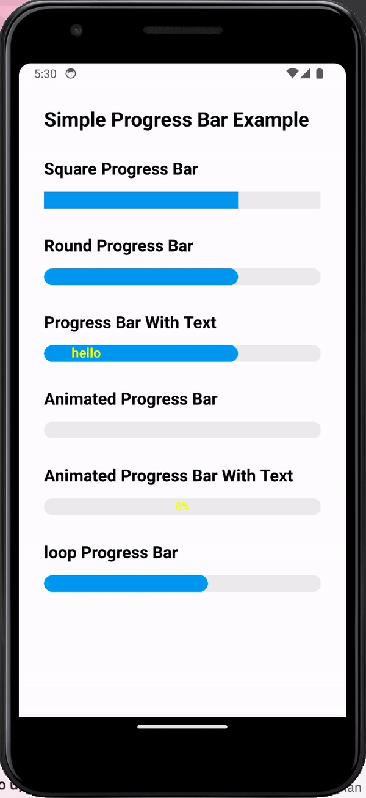

# react-native-progress-bar

Lightweight react-native progress bar using `react-native-svg`.

## Demo



## Prerequisites

⭐️ Peer Dependencies

- [react-native-svg](https://www.npmjs.com/package/react-native-svg#installation)

## Installation

```
$ npm install @roseline124/react-native-progress-bar
$ yarn add @roseline124/react-native-progress-bar
```

## Example

you can refer example code in this repository.

```typescript
import { ProgressBar } from 'react-native-progress-bar'

<ProgressBar
    progress={0.3}
    width="100%"
    height={20}
    borderWidth={0}
    color={color}
    unfilledColor="#eee"
    indeterminate={true}
    textProps={{
        text: `30%`,
        fontSize: 13,
        fontWeight: 'bold',
        color: 'yellow',
        textAlign: 'middle',
    }}
/>
```

## Props

| Prop                        | Description                                                                  | Default                |
| --------------------------- | ---------------------------------------------------------------------------- | ---------------------- |
| **`animated`**              | Whether or not to animate changes to `progress`.                             | `true`                 |
| **`borderColor`**           | Color of outer border.                                                       | `color`                |
| **`borderRadius`**          | Radius of progress bar.                                                      | `height/2`             |
| **`borderWidth`**           | Width of outer border, set to `0` to remove.                                 | `0`                    |
| **`color`**                 | Fill color of the indicator.                                                 | `rgba(0, 122, 255, 1)` |
| **`lineCap`**               | The end of the indicator. (`square` or `round`)                              | `round`                |
| **`width`**                 | Width of the bar. (number or percentage)                                     | `100%`                 |
| **`height`**                | Height of the bar.                                                           | `6`                    |
| **`loop`**                  | If set to true, the indicator will spin and `progress` prop will be ignored. | `false`                |
| **`loopAnimationDuration`** | Sets animation duration in milliseconds when loop is set.                    | `1000`                 |
| **`progress`**              | Progress of whatever the indicator is indicating. A number between 0 and 1.  | `0`                    |
| **`unfilledColor`**         | Color of the remaining progress.                                             | `rgba(0,0,0,0)`        |
| **`onLayout`**              | Handle the event when component is mounted                                   | _None_                 |
| **`containerStyle`**        | Style of the View wrapping ProgressBar                                       | _None_                 |
| **`animationType`**         | Animation Type ('decay' or 'timing' or 'spring')                             | _None_                 |
| **`animationConfig`**       | Animation Config                                                             | _None_                 |
| **`textProps`**             | Refer the `ProgressBarTextProps` interface.                                  | _None_                 |

## Test in local

1. `pnpm pack`
2. pnpm install `{relative_path}/react-native-progress-bar-1.x.x.tgz`
3. test the library

I can't found the way to link the local library to example project.
The `pnpm link` is not working. If you know the best way to deal with this issue, please let me know!

I'm fine thank you and you.(this is korean joke.)
